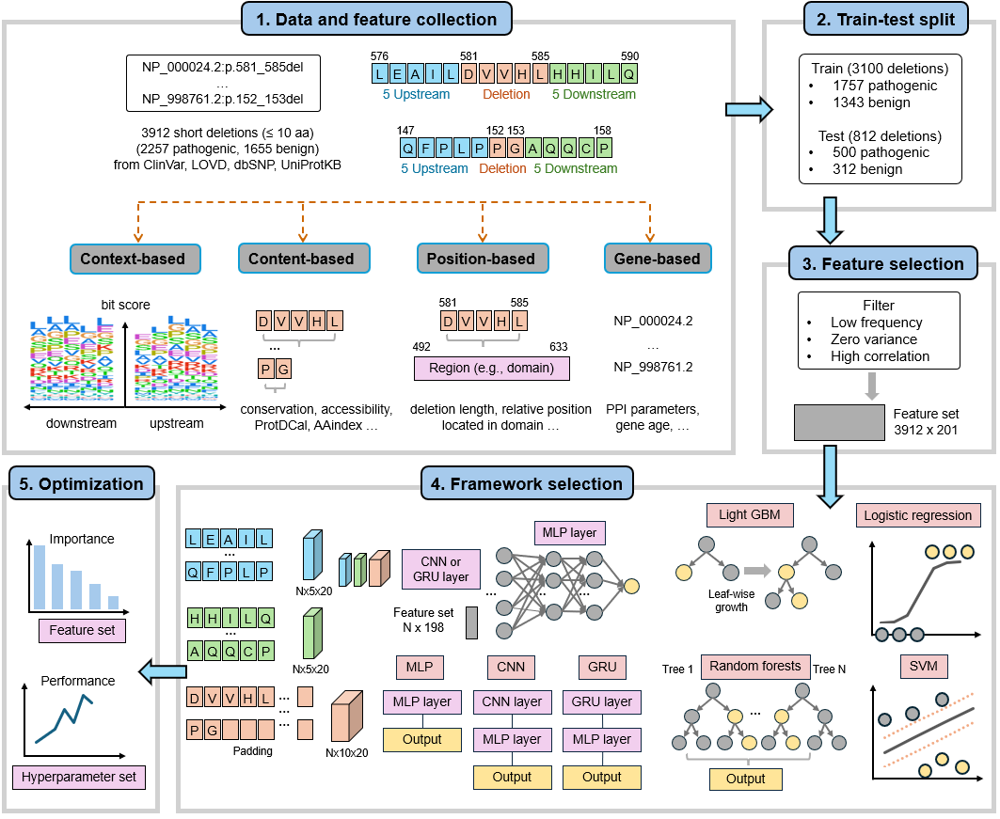
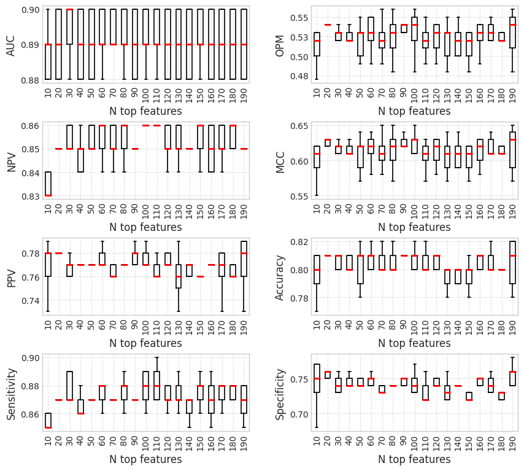
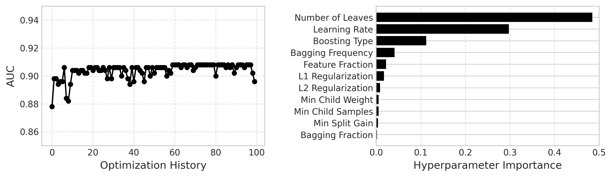
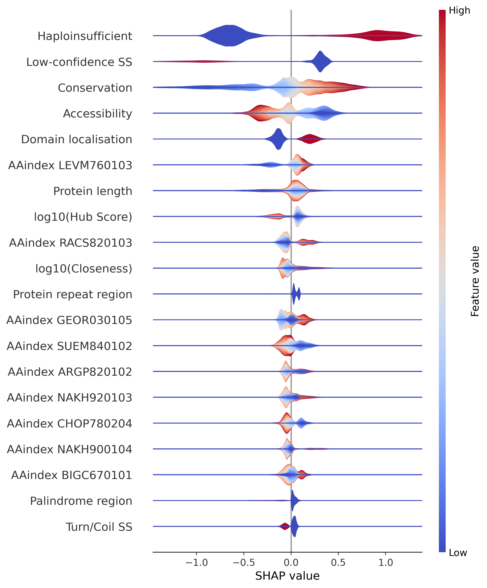

# PON-Del: Predictor for Short Protein Deletions

## Overview
PON-Del is a machine learning–based predictor for short (1–10 amino acid) sequence-retaining deletions.  
It was trained on a curated dataset of variants, and several frameworks were evaluated. 
After comprehensive benchmarking, LightGBM was selected as the final model, demonstrating superior performance compared to other tools.

This repository provides the training data and scripts used in model development.  
To use the method, please visit the online server at [https://structure.bmc.lu.se/pon_del/](https://structure.bmc.lu.se/pon_del/).

<div align="center">
  
</div>

---

## Dependencies
- Python 3.8  
- Required packages:  
  pandas, numpy, scikit-learn, scipy, lightgbm, optuna, shap, seaborn, matplotlib, torch

---

## Dataset
<div align="center">

| Class | Training set (Deletions) | Training set (Proteins) | Blind test set (Deletions) | Blind test set (Proteins) | Total (Deletions) | Total (Proteins) |
|--------|---------------------------|--------------------------|-----------------------------|----------------------------|-------------------|------------------|
| Pathogenic | 1757 (56.68%) | — | 500 (61.58%) | — | 2257 | — |
| Benign | 1343 (43.32%) | — | 312 (38.42%) | — | 1655 | — |
| Total | 3100 | 1524 | 812 | 380 | 3912 | 1904 |

</div>

Data file: [`data/data_withFeat.csv`](data/data_withFeat.csv)

---

## Scripts

| File | Description |
|------|--------------|
| `code/train_00_function.py` | Utility functions and model architectures |
| `code/train_01_featSelect.py` | Feature filtering |
| `code/train_02_lgbm_featSelect.py` | Feature selection |
| `code/train_03_lgbm_hyperparaOptimize.py` | Hyperparameter optimization |
| `code/train_04_frameworkCompare.py` | Framework comparison across ML and DL models |
| `code/train_05_lgbm_plot.py` | SHAP plots |

---

## Quick Start

### 1) Preparation
Clone and enter the repository:
```bash
git clone git@github.com:zhanghaoyang0/pon_del_public.git
cd pon_del_public
```

### 2) Training pipeline

Note: Theoretically, feature selection `code/train_02_lgbm_featSelect.py` and hyperparameter optimization `code/train_03_lgbm_hyperparaOptimize.py` should be performed after model training and framework comparison `code/train_04_frameworkCompare.py`.
However, for practical workflow, the scripts are organized in this order to enable all training processes to be executed once.

* **Feature filtering**  
  Filters features based on variance threshold, correlation analysis, and binary feature frequency.
  Saves the filtered dataset to `data/data_filteredFeat.csv`.
  ```bash
  python code/train_01_featSelect.py 
  ```
* **Feature selection**  
  Selects features using Recursive Feature Elimination (RFE) with LightGBM.
  Based on the performance plot, the top 20 features are selected.
  Saves feature importance to `data/dict_lgbmFeatImp.pkl`.
  ```bash
  python code/train_02_lgbm_featSelect.py 
  ```

<div align="center">

</div>

* **Hyperparameter optimization**  
  Performs Optuna-based tuning for LightGBM parameters.
  Optimization history is saved in `result/lgbm_hyperparaOptimized.csv`.
  The contribution of optimization is minimal.
  ```bash
  python code/train_03_lgbm_hyperparaOptimize.py 
  ```
<div align="center">

</div>

* **Training and framework comparison**  
  Runs cross-validation and final training with framework comparison across multiple models:
  LightGBM, Random Forest, Logistic Regression, SVM, MLP, CNN, GRU.

  ```bash
  python code/train_04_frameworkCompare.py 
  ```

  Results are saved to `result/performance.csv`, and trained models are stored in `model/`.

* **SHAP analysis**  
  Generates SHAP plots for model interpretation and feature importance analysis.

  ```bash
  python code/train_05_lgbm_plot.py 
  ```

<div align="center">

</div>


## Contact
Developed by Haoyang Zhang and Muhammad Kabir, supervised by Mauno Vihinen.
Feel free to find me via haoyang.zhang@med.lu.se.